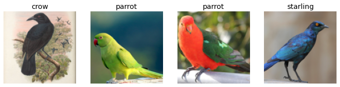
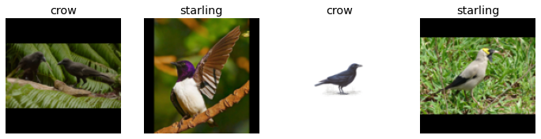
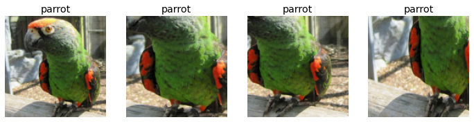
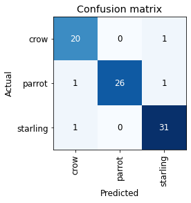
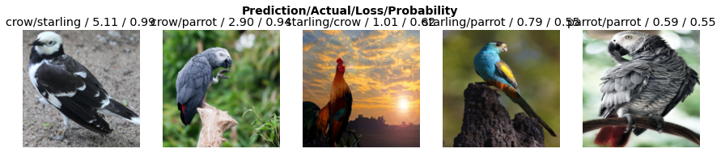

# The FastAI Revolution & Image Classification
Hello and welcome to this blog, where I will document things I learn along my AI&ML journey.
One piece of learning material that has caught my eye is [fastAI](https://www.fast.ai/) which includes many courses featuring a Top-Down approach.
A top-down approach is extremely important for most folks, since without a strong **why** most of us cannot bring ourselves to learn new things.

I will approach these tutorials from the viewpoint of someone in the computer vision industry and highlight parts that seem interesting to me
## Image Classification on Self-Aggregated Datasets
ML/Data Science folks are useless without data, and as such we first need some of it, though not that much. Why? Transfer Learning (think of it as a roided-out football player trying to *transfer* to doing 10 push-ups, should be pretty easy for the guy, right?)

**Pretrained ImageNet model on a 3-class image dataset visualized**


Since I am having some trouble in the garden with birds eating off fruit trees, I thought it would be useful to be starting this series with a bird classifier, which I might later deploy on a personal [drone](https://www.ryzerobotics.com/tello) (don't hold your breath on it :D)

### Creating the Dataset
Below is the code for creating the dataset, I chose starlings, crows and parrots, all which love fruit trees.
The `search_images_bing` function is ripped straight out of [fastbook](https://github.com/fastai/fastbook)


```python
bird_types = 'starling','crow','parrot'
path = Path('birds')
if not os.path.exists(path):
    for o in bird_types:
        dest = (path/o)
        os.makedirs(dest,exist_ok=True)
        results = search_images_bing(key, f'{o}')
        download_images(dest, urls=results.attrgot('contentUrl'))
```

Below we can see the paths for the image files, the label of the class being the parent directory, in straightforward fashion


```python
fns = get_image_files(path)
fns
```


    (#415) [Path('birds/crow/00000013.jpg'),Path('birds/crow/00000054.jpg'),Path('birds/crow/00000131.jpg'),Path('birds/crow/00000062.jpg'),Path('birds/crow/00000037.jpg'),Path('birds/crow/00000048.jpg'),Path('birds/crow/00000009.jpg'),Path('birds/crow/00000020.jpg'),Path('birds/crow/00000138.jpg'),Path('birds/crow/00000015.jpg')...]


### Corrupt Data is Corrupt
And as with any computer task (or programming in general), things will go wrong, in our case some of the images are not valid, having invalid header files, invalid extensions or somehow ended up corrupted through the download process.
Since we do not want for model training to die right at the end of a very lengthy first epoch (happens to all of us...eventually), we discard the corrupted images


```python
failed = verify_images(fns)
failed
```


    (#6) [Path('birds/crow/00000087.jpg'),Path('birds/crow/00000146.png'),Path('birds/crow/00000023.jpg'),Path('birds/crow/00000041.jpg'),Path('birds/parrot/00000047.jpg'),Path('birds/parrot/00000148.jpg')]


```python
failed.map(Path.unlink);
```

### Buidling the DataLoader
Now the FastAI magic is really showing, making DataLoading a seemingly easy task, at least when training on only one GPU machine.


```python
birds = DataBlock(
    blocks=(ImageBlock, CategoryBlock), # images, classifying task
    get_items=get_image_files, # we get all images from a path
    splitter=RandomSplitter(valid_pct=0.2, seed=42), 
    get_y=parent_label, # class based on parent folder
    item_tfms=Resize(128))
```

Breaking it down we have:
- blocks:
    - ImageBlock (data type)
    - CategoryBlock (label type)
- get_items: Function that supplies ImageBlock with image file paths (function showcased above)
- splitter: How we split the data, for reproducibility we set a seed so that the experiment can be reproduced reliably by others (splitting the data the same way every time)
- get_y: function for getting the CategoryBlock label, in our case the parent folder being the label
- item_tfms: Resize to 128 so we can efficiently batch images in training, (if the model architecture includes adaptive layers, image size does not "matter" as in the model still runs,and we only need to keep image size consistent through the batches, 128 being just a number. HOWEVER below the model declared is a classical resnet which does NOT include adaptive layers, hence 128 is actually a requirement)


```python
dls = birds.dataloaders(path)
```

### Data Visualization is an Imperative

What I really like about fastAI and determined me to learn it was the interactivity between developer and data, visualizing data in a jupyter notebook is just easier.


```python
dls.valid.show_batch(max_n=4, nrows=1)
```


    

    


### Resize strategies

Remember the 128x128 resize? Here it is in action, simple as `show_batch`.

The way we resize the images is important, below you can see padding of smaller images to match bigger ones, while keeping aspect ration consistent.
Aspect ration might be **extremely** important depending on your type of data, and is rightly focused upon in the literature.


```python
birds = birds.new(item_tfms=Resize(128, ResizeMethod.Pad, pad_mode='zeros'))
dls = birds.dataloaders(path)
dls.valid.show_batch(max_n=4, nrows=1)
```


    

    


And below we can see simple cropping of a bigger image, which sometimes works, but as you can see below, critical image features can be missed. This is why visualization is so important!


```python
birds = birds.new(item_tfms=RandomResizedCrop(128, min_scale=0.3))
dls = birds.dataloaders(path)
dls.train.show_batch(max_n=4, nrows=1, unique=True)
```


    

    


Ok, ok, let's calm down with the visualizations and just train an actual model. Iteration through model-feedback is better than eternal analysis of the dataset by hand.


```python
birds = birds.new(
    item_tfms=RandomResizedCrop(224, min_scale=0.5),
    batch_tfms=aug_transforms())
dls = birds.dataloaders(path)
```

    /home/frost/.local/lib/python3.9/site-packages/torch/_tensor.py:1023: UserWarning: torch.solve is deprecated in favor of torch.linalg.solveand will be removed in a future PyTorch release.
    torch.linalg.solve has its arguments reversed and does not return the LU factorization.
    To get the LU factorization see torch.lu, which can be used with torch.lu_solve or torch.lu_unpack.
    X = torch.solve(B, A).solution
    should be replaced with
    X = torch.linalg.solve(A, B) (Triggered internally at  /pytorch/aten/src/ATen/native/BatchLinearAlgebra.cpp:760.)
      ret = func(*args, **kwargs)


We will be using a resnet18 architecture right now, which is good enough for our simple task. The smaller the model the faster the training


```python
learn = cnn_learner(dls, resnet18, metrics=error_rate)
learn.fine_tune(4)
```

    Downloading: "https://download.pytorch.org/models/resnet18-f37072fd.pth" to /home/frost/.cache/torch/hub/checkpoints/resnet18-f37072fd.pth


      0%|          | 0.00/44.7M [00:00<?, ?B/s]


    /home/frost/.local/lib/python3.9/site-packages/torch/nn/functional.py:718: UserWarning: Named tensors and all their associated APIs are an experimental feature and subject to change. Please do not use them for anything important until they are released as stable. (Triggered internally at  /pytorch/c10/core/TensorImpl.h:1156.)
      return torch.max_pool2d(input, kernel_size, stride, padding, dilation, ceil_mode)


<table border="1" class="dataframe">
  <thead>
    <tr style="text-align: left;">
      <th>epoch</th>
      <th>train_loss</th>
      <th>valid_loss</th>
      <th>error_rate</th>
      <th>time</th>
    </tr>
  </thead>
  <tbody>
    <tr>
      <td>0</td>
      <td>1.607630</td>
      <td>0.371953</td>
      <td>0.148148</td>
      <td>00:04</td>
    </tr>
  </tbody>
</table>


<table border="1" class="dataframe">
  <thead>
    <tr style="text-align: left;">
      <th>epoch</th>
      <th>train_loss</th>
      <th>valid_loss</th>
      <th>error_rate</th>
      <th>time</th>
    </tr>
  </thead>
  <tbody>
    <tr>
      <td>0</td>
      <td>0.374751</td>
      <td>0.249112</td>
      <td>0.098765</td>
      <td>00:04</td>
    </tr>
    <tr>
      <td>1</td>
      <td>0.300083</td>
      <td>0.156646</td>
      <td>0.049383</td>
      <td>00:04</td>
    </tr>
    <tr>
      <td>2</td>
      <td>0.219900</td>
      <td>0.160551</td>
      <td>0.061728</td>
      <td>00:04</td>
    </tr>
    <tr>
      <td>3</td>
      <td>0.193315</td>
      <td>0.156828</td>
      <td>0.049383</td>
      <td>00:04</td>
    </tr>
  </tbody>
</table>


### Interpretation of predictions

A model never lives alone, at least in my experience it always lived alongside an complex expert system of sorts. By interpreting the model we can see that some classes are confused with others, and depending on the task at hand we might want to signal to the system against a potential crow even if our model is 50-50 on whether it's a crow or a parrot.


```python
interp = ClassificationInterpretation.from_learner(learn)
interp.plot_confusion_matrix()
```


    

    


### Data cleaning through model feedback

Now this right here is what made me a true believe in fastAI and it's usecase in commercial ML applications. By training a model and simply highlighting the top losses, we might detect outliers in the dataset. These outliers are very likely mislabeled data points, eliminating them can significantly improve the model's performance. In hindsight this seems like an obvious usecase of the Neural Network, but us ML people get very hung up about architectures and such, while we should focus more on improving the data in a smarter way.


```python
interp.plot_top_losses(5, nrows=1)
```


    

    


Of course the cleaning aspect is built-in with a handy jupyter widget to boot!


```python
cleaner = ImageClassifierCleaner(learn)
cleaner
```


    VBox(children=(Dropdown(options=('crow', 'parrot', 'starling'), value='crow'), Dropdown(options=('Train', 'Val…


### The Export:

The export step can end up being one of the most important steps in a model's pipeline. In very many applications realtime inference is imperative, and as such we need to use various inference acceleration backends such as [TensorRT](https://developer.nvidia.com/tensorrt)


```python
learn.export()
```


```python
path = Path()
path.ls(file_exts='.pkl')
```


    (#1) [Path('export.pkl')]


```python
learn_inf = load_learner(path/'export.pkl')
learn_inf.dls.vocab
```


    ['crow', 'parrot', 'starling']


### It's just State Dict

Because FastAI is built upon Pytorch the actual model can be extracted by accessing the `state_dict` attribute.
After which [ONNX](https://onnx.ai/) export is [trivial](https://pytorch.org/docs/stable/onnx.html)
After that? The sky is the limit (ahem...regarding deployment).


```python
learn_inf.state_dict
```

### And So...

I hope I highlighted just a glimpse of how useful fastAI can be, not only as a learning tool but also as a data exploration and model training tool.
In the posts that follow I'll keep on giving my two cents on the fantastic [MOOC](https://course.fast.ai/).

Onward!


